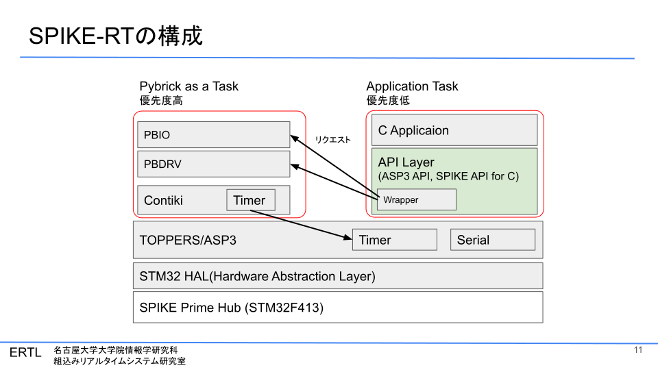

# SPIKE-RTの動作原理の説明 (30分)
2022-08-18  
発表者：
名古屋大学大学院情報学研究科　組込みリアルタイムシステム研究室
朱　義文（@envzhu）

## SPIKE-RTの構成
- Pybricks を ASP3の1タスクとして動かしている．
- デバイス制御用APIの一部は，実行後にPybricksタスクでの対応する処理が行われることを想定している．



# Pybricksの解析
- 全体構成図
- Contiki
- デバイス制御の仕組み

ここでのPybrciksのコードは，[2022-08-18時点でのフォーク](
https://github.com/spike-rt/pybricks-micropython/tree/a5357b7b72162c49e7ad74d2d67fc70addd89b3d)を参照．  
**アップストリームの最新のコミットとは部分的に異なる．**  
将来的には，追従する予定．

## 構成図


### Call Graph（参考までに）
[PybricksCallGraph.pdf](artifacts/PybricksCallGraph.pdf)
レンダリング前のdotファイル[PybricksCallGraph.dot](artifacts/PybricksCallGraph.dot)

- MicroPythonランタイムを除いて，3000の関数
- 関数名によりグループ化
  - pbio_uartdev_counter_init -> pbio_uartdev
-  それでも見にくいのでさらにcluster化
  - pbio_uartdev -> pbio
- その他，手動で表示する関数を調整
- ただし，不正確な部分がある

# Contiki
- Contiki について述べる．
- 論文は，最後の参考文献を参照． 
- コード：[pybricks-micropython/lib/contiki-core/
](https://github.com/spike-rt/pybricks-micropython/tree/a5357b7b72162c49e7ad74d2d67fc70addd89b3d/lib/contiki-core)
- ※ Pybricks では使用されていない機能については大幅に説明を省略．

### 参考文献
- [センサーノード向けに振り切りまくったRTOS「Contiki」が「Contiki-NG」へ進化：リアルタイムOS列伝（16）（1/4 ページ） - MONOist](https://monoist.itmedia.co.jp/mn/articles/2110/28/news047.html)
- Contiki
  - https://github.com/contiki-os/contiki
  - Dunkels A, Gronvall B, Voigt T. Contiki - a lightweight and flexible operating system for tiny networked sensors. In: 29th Annual IEEE international conference on local computer networks. 2004, p. 455–62.
- Contiki-NG
  - https://github.com/contiki-ng/contiki-ng
  - George Oikonomou, Simon Duquennoy, Atis Elsts, Joakim Eriksson, Yasuyuki Tanaka, Nicolas Tsiftes, The Contiki-NG open source operating system for next generation IoT devices, SoftwareX, Volume 18, 2022, https://doi.org/10.1016/j.softx.2022.101089. (https://www.sciencedirect.com/science/article/pii/S2352711022000620)
- protothreads
  - Dunkels A, Schmidt O, Voigt T, Ali M. Protothreads: Simplifying eventdriven programming of memory-constrained embedded systems. In: Proceedings of the 4th international conference on embedded networked sensor systems. New York, NY, USA: ACM; 2006, p. 29–42.

## 概要
- 想定
  - 無線センサネットワークのデバイス
  - 省電力
  - 8-bit/16-bit マイコン
- 動的ローディング・アンローディングがコンセプト （詳細は省略）
- 省電力無線通信を標準でサポート
- Cooja というネットワークシミュレータが付属
- 後継プロジェクトとして，Contiki-NG
  - カーネルの大部分は変わっておらず，主にサポートしている通信規格・プロトコルの刷新が中心
- 影響
  - 無線センサネットワークにおいて大成功を収めている（ように見える）．
- 原理
  - event-driven kernel
  - ハイブリッド型のマルチタスク
    - カーネル：協調的マルチタスク（ノンプリエンプティブ・マルチタスク）
    - プロセス：プリエンプティブ・マルチタスクは，ライブラリによりカーネルではなくプロセスレベルで提供．
  - プロセスは，イベントドリブン・プログラミング，または，protothread による記述．

## 原理
### 構成
- カーネル (= プロセス・スケジューラ)
- ライブラリ
- プログラム・ローダ
- その他，複数のプロセス

※ Contikiでは処理単位をプロセスと呼ぶ．  
※ 通信量削減のためプロセス単位で動的ローディングを行う機能がある．

### event-driven system
(提唱元の論文が引用されているが，そちらは未調査)
各プロセスは，イベントハンドラとして実装され，終了するまで実行し続ける．  
協調的マルチタスク（ノンプリエンプティブ・マルチタスク）．  
カーネルが勝手に実行権を取り上げない．

- メリット
  - スタックをプロセスごとに用意する必要がない．省メモリフットプリント
  - プリエンプションが発生しないためロック処理が必要ない．
- デメリット
  - ステートマシン・プログラミングになる．（時間的順序）
  - protothread という新たなプログラミング手法により回避．（後述）
  - 重い処理となった場合に，長時間，実行権が他のプロセスに回らない．
    - ライブラリによりプロセスレベルで，スタックベースのプリエンプティブ・マルチスレッディングを提供
    - 複数のプロセス実行をまたいでの，プリエンプティブ・マルチスレッディングが可能かどうかは不明．

### プロセス
プロセスは
- イベントハンドラ
- ポーリングハンドラ（任意）
で実装される．

プロセスの実行要因 : 
- プロセス宛のイベント発生
- プロセス宛のポーリング要求

カーネルは引数に実行要因を指定してプロセスを実行．  
プロセスは，実行要因に応じた処理を実行．

### ポーリング要求
process_poll()  
割り込みハンドラから要求される．

### イベント
特定のプロセス宛にイベントを送ることができる．
プロセスコンテキストから呼び出すのが普通．
- 非同期イベント
  - process_post()
  - その後，プロセスを実行．
- 同期イベント
  - process_post_synch()
  - process_post_synch() 内で，すぐにプロセスを呼び出す．

原始的なプロセス間通信を行える．  
高度なプロセス間通信の機能は，動的ローディングのため，イベントを利用してプロセスとして実装．  
Pybricks は使用してない．

### イベントタイマ
イベントを用いて，プロセスとして，イベントタイマetimerが実装されている．
これにより周期処理を実現．

### スケジューリング
常に，イベントよりもポーリング要求が優先的にスケジューリングされる．  
2 段階の優先度と見なせる

## カーネルのAPI
初期化処理以外で，Pybricks のアプリケーションで呼びされているもの．
```c
PROCESS_CURRENT(); // 実行中のプロセスを表す．
CCIF void process_poll(struct process *p);
CCIF int process_post(struct process *p, process_event_t ev, process_data_t data);
CCIF void process_post_synch(struct process *p,
			     process_event_t ev, process_data_t data); 
```

## protothread
イベントドリブン・プログラミングにおいても，スレッドのようなスタイルでプログラミングする手法．  
（イベントドリブン・プログラミングでは，必然的にステートマシン・プログラミングとなる．）  
マクロにより内部的にはステートマシンプログラミングに変換される．

以下の例は，Dunkels Aらの論文より引用
```c
int sender(pt) {
  PT_BEGIN(pt);

  /* ... */
  do {
    PT_WAIT_UNTIL(pt, cond1);
  } while(cond);
  /* ... */
  PT_END(pt);

}
```

マクロ展開後
```c
int sender(pt) {
  switch(pt->lc) {
    case 0:
      /* ... */
      do {
        pt->lc = 8;
    case 8:
        if(!cond1)
        return PT_WAITING;
      } while(cond);
      /* ... */
  }
  return PT_ENDED;
}
```


## Pybricks におけるContikiの実行タイミング
- MicroPythonランタイムが `pb_stm32_poll()`を暇な時などに自主的に呼び出す．
  - 割り込みによりポーリング要求が発生しても，対応するポーリングハンドラはすぐに実行されるとは限らない．
- [pb_stm32_poll()](https://github.com/spike-rt/pybricks-micropython/blob/a5357b7b72162c49e7ad74d2d67fc70addd89b3d/bricks/stm32/main.c#L47)
  - `while (pbio_do_one_event()) {}`により全ての実行可能状態のプロセスを実行．
  - `process_nevents()`により実行可能状態のプロセスが存在しないことを確認してスリープ(`WFI`)．
    - `process_nevents()` = nevents + poll_requested．つまり実行可能状態のイベント数とポーリング要求の有無(bool)の和．
- 割り込みにおいて，ポーリング要求が発生し，poll_requestedがセットされることによる競合状態を防ぐためにIRQ割り込み禁止としている．

```c
void pb_stm32_poll(void) {
    while (pbio_do_one_event()) {
    }

    mp_handle_pending(true);

    // There is a possible race condition where an interupt occurs and sets the
    // Coniki poll_requested flag after all events have been processed. So we
    // have a critical section where we disable interupts and check see if there
    // are any last second events. If not, we can call __WFI(), which still wakes
    // up the CPU on interrupt even though interrupts are otherwise disabled.
    mp_uint_t state = disable_irq();
    if (!process_nevents()) {
        __WFI();
    }
    enable_irq(state);
}
```

### 割り込み
`process_poll()`により対応するプロセスのポーリング要求をセットする．

# Pybricksのデバイス制御の仕組み
- アプリケーション： Pybricksが用意したMicroPython向けAPIを呼び出すことで制御
  - [pybricks-micropython/pybricks/hubs/pb_type_primehub.c](https://github.com/spike-rt/pybricks-micropython/blob/spike-rt/pybricks/hubs/pb_type_primehub.c)や[pybricks-micropython/pybricks/pupdevices/](https://github.com/spike-rt/pybricks-micropython/tree/spike-rt/pybricks/pupdevices)あたりに実装がある．
  - これを移植することで，spike-rtにおけるデバイス制御を実現できると期待．


- 同期的処理
  - デバイス制御を行う関数を直接呼び出す．
  - Contikiに依存しない．
    - MicroPythonランタイムには依存する．`printf()`, `mp_hal_delay_ms()`, `nlr_push()/nlr_pop()`など．
  - Hub内蔵のデバイスの多くが該当．
- 非同期的処理
  - 担当のプロセスにリクエストを送り，後続のContikiの実行で必要な処理を実行することを期待． 
  - すぐに実行されないのが普通
  - PUPデバイス，LEDやMatrix DisplayなどのHubデバイス，

## Pybricksの全プロセス


## PUPデバイスの動作の仕組み
非同期に処理される．
- HubとPUPデバイスはUARTにより接続されている．
- モードのセット
  - モードは，送信・受信，データの種類（取得するセンサーデータの形式など）を指定する
  - モードの変更の反映には，数10msかかる．
- 受信の場合
  - プロセス：PUPデバイスが定期的にHubに送信．Hubが受信データ（モードごとに固定長）を共有変数に更新する．
  - API：共有変数を参照し，データを適宜変形して，アプリケーションに渡す．
- 送信の場合
  - API：モード変更を行い，送信データの先頭を送信する．残りのデータが送信されるまで待つ．
  - プロセス：残りのデータをUARTのバッファに空きが生じるたびに送信．

### モータの場合
- プロセス：上記のUARTによる回転情報の取得に加え，共有変数の値からタイマPWMによる制御（同期的）を行う．
- API：モータ制御に必要な計算を行い共有変数を更新する．

# API
- ※1 ... Pybricks の関数を呼び出すことで動作する場合を含む．
- ※2 ... 動作確認にはしてないが動作することが期待される．

| Hub本体機能 | 動作対応(※1) | spike-rtの対応 | 
| :--- | :--- | :--- |
| LED マトリックスディスプレイ | O | X |
| 単一LED | O | O |
| ボタン | O | X |
| IMU | O | X |
| スピーカ | △(※2) | X |
| 外部フラッシュメモリ | X | X |
| USBシリアル | O | X |
| Bluetooth | O | X |

| PUPデバイス | 動作対応 | spike-rtの対応 |
| :--- | :--- | :--- |
| カラーセンサ | O | O |
| 超音波センサ | O | O |
| フォースセンサ | O | O |
| モータ | O | X |


# 備考
## リアルタイム性
- 現状，Pybricksを単一の高優先度のタスクとして動かしており，処理時間の予測が難しく，最悪応答時間を見積もりにくい．
- 処理時間の予測が難しい・低優先度のプロセス（USB, Bluetoothなど）を別のContikiタスクに分離する予定．
  - ほとんどのプロセスが5ms周期で動いているので，最悪応答時間 < 10ms?

## 競合状態(Race Condition)
スケジューリングのタイミングや順序によって，システムの振る舞いが変わってしまうタイミングバグ．
- あるタスクがあるメモリ番地に読み書きしている最中に，プリエンプションが発生して，別のタスクが同一のメモリ番地を読み書きする．-> バグが発生．

並行処理と並列処理の両方で発生

※　データ競合：同時に複数のタスクが同一のメモリ番地に対して読み書きを行うこと（少なくとも1つのタスクが書き込みを行っている）並列処理（マルチコア）でのみ発生

### 一般的な対策
- カーネルのロック機能
- 割り込み禁止
- プライオリティ・シーリング（タスクの優先度を一時的に上げる）
- 優先度を同レベルに設定する．
  - 

### SPIKE-RTの場合
- Contiki上のプロセスはプリエンプションが生じないことが前提で実装されているため，ロックされない．
タイミングによっては，リクエストを送る関数と競合状態が発生する可能性がある．
とりあえず，考慮しなくて良い．（今後，こちらで調査の上，対応予定）